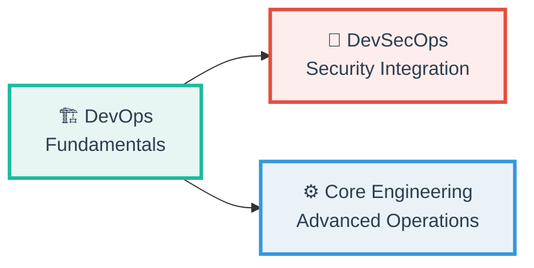
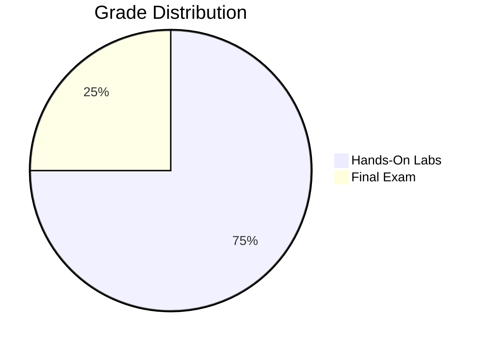
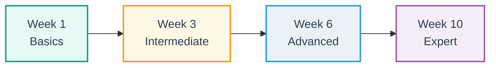
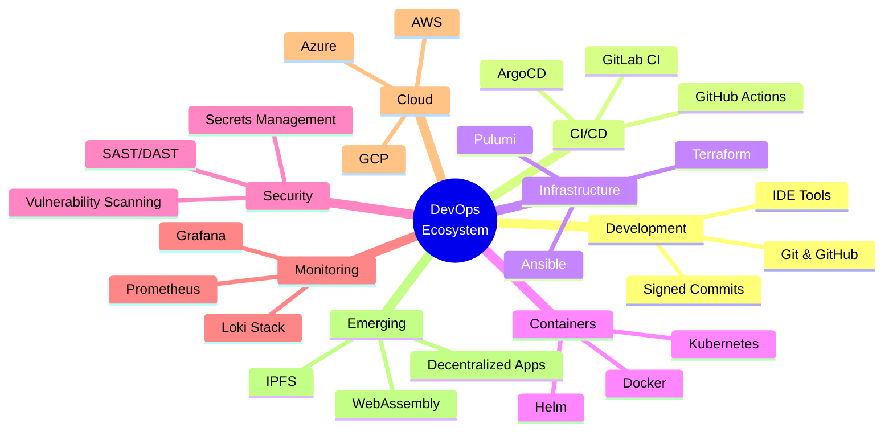

<!-- Hero Banner / Logo -->

  

<h1 align="center">Innopolis DevOps & DevSecOps Courses</h1>

  <strong>Hands-on, evolving courses in DevOps, DevSecOps & Cloud Engineering</strong> 
  Built for learning, collaboration & cutting-edge skills 🚀

  
  
  
  

  Welcome to <strong>Innopolis University's DevOps & DevSecOps Education Hub</strong> — where modern software engineering meets hands-on learning through progressive, practical labs designed to build real-world skills.

---

## 🌟 Our Mission

> **Transforming students into industry-ready DevOps engineers through immersive, hands-on lab experiences that evolve with the industry.**

We believe in:
- 🎯 **Practice over theory** — 80%+ hands-on labs
- 🔄 **Continuous evolution** — Curriculum updates every semester
- 🌐 **Real-world workflows** — Industry-standard tools and practices
- 🤝 **Open collaboration** — Learn by building, sharing, and reviewing

---

## 📚 Courses

Our curriculum evolves across three progressive tracks, each building upon foundational concepts while introducing advanced topics:

### 🏗️ DevOps Introduction

**The Foundation** — Master core DevOps principles and practices

📖 Course Overview

**Duration:** 10 weeks | **Labs:** 10 required + 2 bonus | **Credits:** 80% labs / 20% exam

**What You'll Learn:**
- Git & advanced version control workflows
- CI/CD pipelines with GitHub Actions
- System administration, networking & diagnostics
- Virtualization with VirtualBox
- Container fundamentals with Docker
- GitOps principles & drift detection
- SRE practices & monitoring
- DevSecOps tools (OWASP ZAP, Trivy)
- Cloud computing basics (AWS/GCP/Azure)
- **Bonus:** IPFS, 4EVERLAND, WASM containers

**Key Technologies:**
`Git` `GitHub Actions` `Docker` `VirtualBox` `Checkly` `OWASP ZAP` `Trivy` `AWS` `GCP` `Azure` `IPFS` `WebAssembly`

### 🔐 DevSecOps Introduction

**Security Integration** — Shift security left into every stage of development

📖 Course Overview

**Duration:** 10 weeks | **Labs:** 10 | **Credits:** 80% labs / 20% exam

**What You'll Learn:**
- Secure SDLC & OWASP Top 10
- Threat modeling (STRIDE analysis)
- Secure Git workflows & secrets management
- CI/CD security & build hardening
- Application security testing (SAST/DAST/SCA)
- Infrastructure-as-Code security scanning
- Container & Kubernetes security
- Software supply chain security (SBOM, provenance)
- Security monitoring & compliance (GDPR, NIST, ISO)
- Vulnerability management & response (CVSS)

**Key Technologies:**
`Git-secrets` `Gitleaks` `Semgrep` `Bandit` `OWASP ZAP` `Terraform` `Checkov` `KICS` `Trivy` `Snyk` `Kubernetes` `Syft` `Grype` `Cosign` `Prometheus`

### ⚙️ Core DevOps Engineering

**Advanced Operations** — Deep dive into infrastructure, orchestration, and automation

📖 Course Overview

**Duration:** 16 weeks | **Labs:** 16 | **Credits:** 70% labs / 30% exam

**What You'll Learn:**
- Full-stack web application development
- Advanced containerization strategies
- Infrastructure as Code with Terraform
- Configuration management with Ansible
- Observability & logging (Loki Stack)
- Monitoring with Prometheus & Grafana
- Kubernetes fundamentals & declarative manifests
- Helm charts & library patterns
- Kubernetes secrets management (Vault)
- ConfigMaps & environment management
- GitOps with ArgoCD
- StatefulSet optimization
- Advanced Kubernetes patterns (init containers)
- Decentralized infrastructure (IPFS, Fleek)

**Key Technologies:**
`Terraform` `Ansible` `Kubernetes` `Helm` `ArgoCD` `Prometheus` `Grafana` `Loki` `Vault` `StatefulSets` `IPFS` `Fleek`

---

## 🗺️ Learning Journey

Our curriculum follows a progressive skill tree, building from fundamentals to advanced practices:

```mermaid
graph TB
    ROOT[🎓 DevOps Mastery]
    
    %% Foundation Track
    ROOT --> FOUND[🏗️ Foundation]
    FOUND --> F1[Version Control<br/>Git & GitHub]
    FOUND --> F2[CI/CD Basics<br/>GitHub Actions]
    FOUND --> F3[Containerization<br/>Docker Fundamentals]
    
    %% Infrastructure Track
    ROOT --> INFRA[🏗️ Infrastructure]
    INFRA --> I1[Virtualization<br/>VMs & Hypervisors]
    INFRA --> I2[IaC<br/>Terraform & Ansible]
    INFRA --> I3[Orchestration<br/>Kubernetes & Helm]
    
    %% Security Track
    ROOT --> SEC[🔐 Security]
    SEC --> S1[Secure SDLC<br/>Shift-Left Culture]
    SEC --> S2[AppSec Testing<br/>SAST/DAST/SCA]
    SEC --> S3[Supply Chain<br/>SBOM & Provenance]
    
    %% Operations Track
    ROOT --> OPS[📊 Operations]
    OPS --> O1[Monitoring<br/>Prometheus & Grafana]
    OPS --> O2[GitOps<br/>ArgoCD & Reconciliation]
    OPS --> O3[SRE<br/>Reliability & Metrics]
    
    %% Advanced Track
    ROOT --> ADV[⭐ Advanced]
    ADV --> A1[Cloud Native<br/>AWS/GCP/Azure]
    ADV --> A2[Decentralized<br/>IPFS & Web3]
    ADV --> A3[Edge Computing<br/>WASM & Serverless]
    
    %% Styling
    classDef rootStyle fill:#1a1a1a,stroke:#ffffff,stroke-width:3px,color:#ffffff
    classDef trackStyle fill:#2c3e50,stroke:#3498db,stroke-width:2px,color:#ffffff
    classDef foundModule fill:#e8f6f3,stroke:#1abc9c,stroke-width:2px,color:#2c3e50
    classDef infraModule fill:#eaf2f8,stroke:#3498db,stroke-width:2px,color:#2c3e50
    classDef secModule fill:#fdedec,stroke:#e74c3c,stroke-width:2px,color:#2c3e50
    classDef opsModule fill:#fff3cd,stroke:#f1c40f,stroke-width:2px,color:#2c3e50
    classDef advModule fill:#f4ecf7,stroke:#9b59b6,stroke-width:2px,color:#2c3e50
    
    class ROOT rootStyle
    class FOUND,INFRA,SEC,OPS,ADV trackStyle
    class F1,F2,F3 foundModule
    class I1,I2,I3 infraModule
    class S1,S2,S3 secModule
    class O1,O2,O3 opsModule
    class A1,A2,A3 advModule
```

---

## 🛠 Learning Philosophy

### Hands-On First

**70-80% of your grade comes from practical labs** — each designed to solve real-world problems.

### Progressive Difficulty

Labs build upon each other, creating a cohesive learning path:

### Real-World Tools

Students work with the same tools used by industry professionals:

| Category | Tools |
|----------|-------|
| **Version Control** | Git, GitHub, SSH signing |
| **CI/CD** | GitHub Actions, ArgoCD, GitLab CI |
| **Containers** | Docker, Kubernetes, Helm |
| **IaC** | Terraform, Ansible, Pulumi |
| **Security** | OWASP ZAP, Trivy, Snyk, Semgrep, Checkov |
| **Monitoring** | Prometheus, Grafana, Loki, Checkly |
| **Cloud** | AWS, GCP, Azure, Spin, 4EVERLAND |
| **Emerging** | WebAssembly, IPFS, Fleek |

---

## 📊 Course Structure

### Lab Workflow

Every student follows the same collaborative workflow:

### Grading System

| Score | Grade | Description |
|-------|-------|-------------|
| 90-100 | **A** | Mastery of concepts, exceptional documentation, innovative solutions |
| 75-89 | **B** | Solid understanding, complete implementation, minor improvements needed |
| 60-74 | **C** | Basic competency, core tasks completed, needs reinforcement |
| 0-59 | **D** | Incomplete or fundamental gaps, re-attempt required |

**Special Features:**
- 🎁 **Bonus Labs** — Extra credit for cutting-edge topics (WASM, IPFS, Web3)
- 🏆 **Exam Exemption** — Perfect lab scores can waive final exam requirement
- ⏰ **Flexible Deadlines** — Late submissions accepted with penalty (6/10 max)

---

## 🌐 Technology Ecosystem

Our courses cover the full DevOps toolchain:

---

## 📈 Curriculum Evolution

Our courses evolve continuously to stay current with industry trends:

### Recent Additions

- **Fall 2024:** WebAssembly containers, Spin framework, 4EVERLAND deployment
- **Fall 2024:** Enhanced DevSecOps with supply chain security (SBOM, Sigstore)
- **Spring 2025:** Advanced Kubernetes patterns, StatefulSet optimization
- **Spring 2025:** IPFS & Fleek decentralized infrastructure

### Emerging Topics (Coming Soon)

- **Platform Engineering** — Internal developer platforms (IDPs)
- **FinOps** — Cloud cost optimization & resource management
- **AI/ML Ops** — Model deployment, monitoring, and versioning
- **Service Mesh** — Istio, Linkerd, advanced networking
- **Chaos Engineering** — Resilience testing with Chaos Mesh
- **Policy as Code** — OPA, Kyverno, admission controllers

---

## 🎯 Learning Outcomes

By completing our curriculum, students gain:

### Technical Skills

✅ **Version Control Mastery** — Advanced Git workflows, signed commits, collaboration  
✅ **CI/CD Expertise** — Pipeline design, automation, deployment strategies  
✅ **Container Proficiency** — Docker, Kubernetes, Helm, orchestration  
✅ **Infrastructure as Code** — Terraform, Ansible, declarative infrastructure  
✅ **Security Integration** — SAST/DAST, vulnerability management, shift-left practices  
✅ **Monitoring & Observability** — Prometheus, Grafana, Loki, SRE principles  
✅ **Cloud Native Development** — Multi-cloud deployments, serverless, edge computing  

### Soft Skills

🤝 **Collaboration** — PR reviews, code reviews, team workflows  
📝 **Documentation** — Technical writing, Markdown, architecture diagrams  
🐛 **Troubleshooting** — Log analysis, debugging, root cause analysis  
⏰ **Time Management** — Deadline adherence, task prioritization  
💡 **Problem Solving** — Critical thinking, creative solutions, iterative improvement  

### Career Readiness

🎓 **Portfolio Projects** — 10-16 production-quality lab submissions  
🏆 **Certifications Path** — Preparation for CKA, CKAD, AWS, Azure exams  
💼 **Industry Experience** — Real-world tools, workflows, best practices  
🌐 **Open Source Contribution** — GitHub collaboration, PR etiquette  

---

## 👥 Community

### For Students

- 📚 **Lab Repositories** — Each semester's course materials available as separate repos
- 💬 **Discussion Forums** — Moodle course pages for Q&A and announcements
- 🤝 **Peer Learning** — Collaboration encouraged, code review skills developed
- 🏆 **Recognition** — Top performers featured, exam exemptions available

### For Instructors & Contributors

- 🔧 **Open Curriculum** — Course materials evolve with industry feedback
- 📊 **Analytics** — Student performance data informs curriculum improvements
- 🌍 **Global Reach** — Materials accessible to educators worldwide
- 🤝 **Collaboration** — Contributions welcome (issues, PRs, suggestions)

---

## 🚀 Getting Started

### Current Students

1. **Find Your Course** — Check Moodle for your active course repository
2. **Fork the Repo** — Create your personal workspace
3. **Read the README** — Each course has detailed instructions
4. **Start Lab 1** — Follow the step-by-step guide
5. **Join the Community** — Ask questions, help peers, collaborate

### Educators & Industry

- 🔗 **Reuse Our Materials** — All course content is open for educational use
- 🤝 **Collaborate** — Suggest improvements, share industry insights
- 📧 **Contact Us** — Reach out for partnerships or guest lectures
- ⭐ **Star Our Repos** — Show support, track updates

---

## 📊 Stats & Impact

| Metric | Value |
|--------|-------|
| **Active Courses** | 3+ per semester |
| **Students Annually** | 150+ |
| **Labs Created** | 40+ unique labs |
| **Technologies Covered** | 50+ tools & platforms |
| **Success Rate** | 85%+ pass rate |
| **Industry Adoption** | Tools used by 1000+ companies |

---

## 🌟 Success Stories

> **"The hands-on labs prepared me for my first DevOps role better than any certification. I use these skills daily."**  
> — Alumni, now DevOps Engineer at tech unicorn

> **"The progressive difficulty made complex topics like Kubernetes accessible. The bonus labs on WASM were mind-blowing!"**  
> — Recent graduate, A+ grade

> **"As an instructor, the evolving curriculum keeps me engaged. Students love the real-world tools and workflows."**  
> — Course TA

---

## 🙏 Acknowledgments

Special thanks to:

- **Innopolis University** — For supporting innovative DevOps & DevSecOps education
- **Our Students** — For feedback, bug reports, and continuous improvement suggestions
- **Industry Partners** — For real-world insights and tool access
- **Open Source Community** — For the amazing tools that make this possible
- **Course TAs** — For dedication to student success

---

### 🚀 Ready to Start Your DevOps Journey?

**Explore our courses, fork a repo, and build something amazing!**

---

**Made with ❤️ at Innopolis University**  
*Building the next generation of DevOps & DevSecOps engineers*

